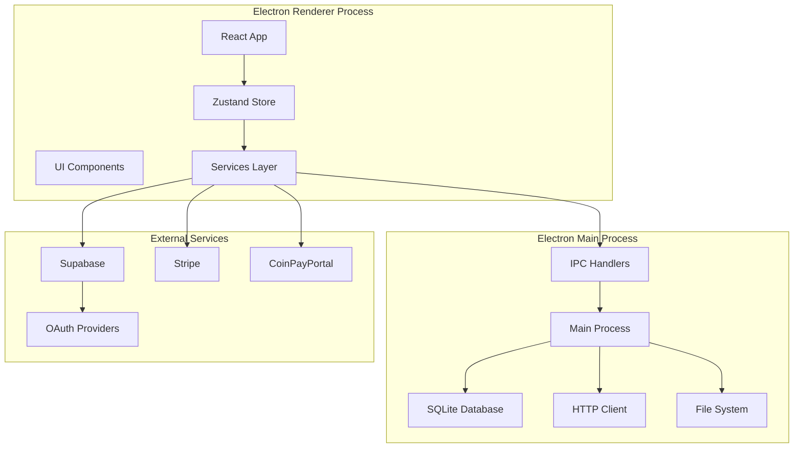
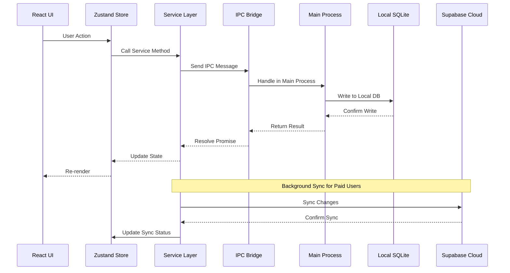
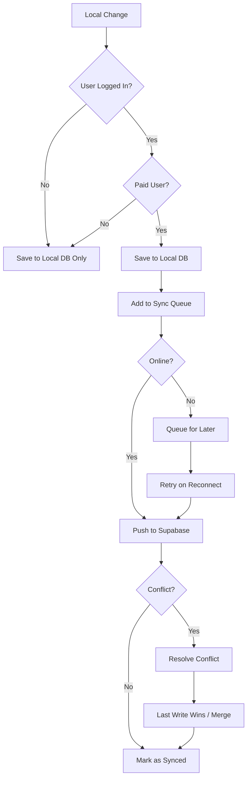
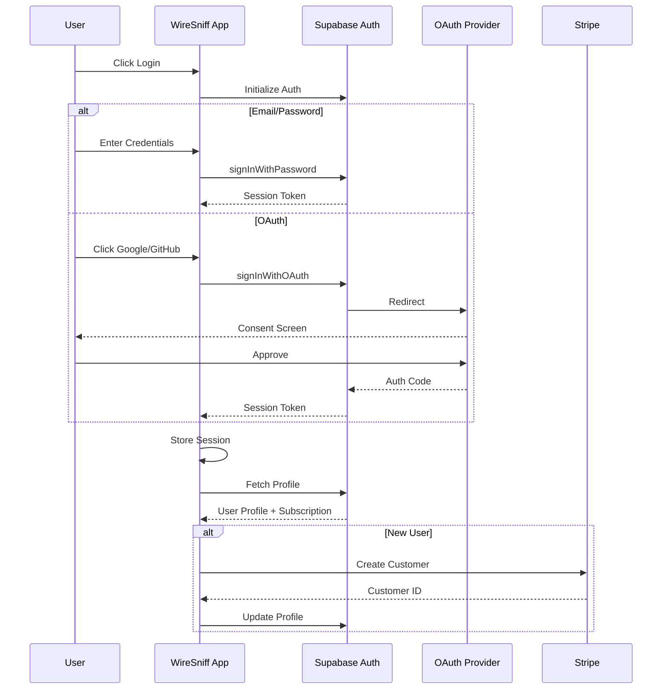
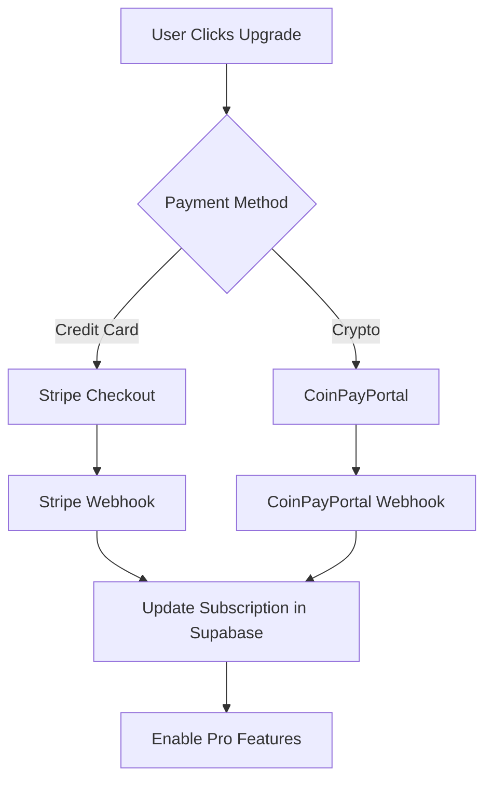
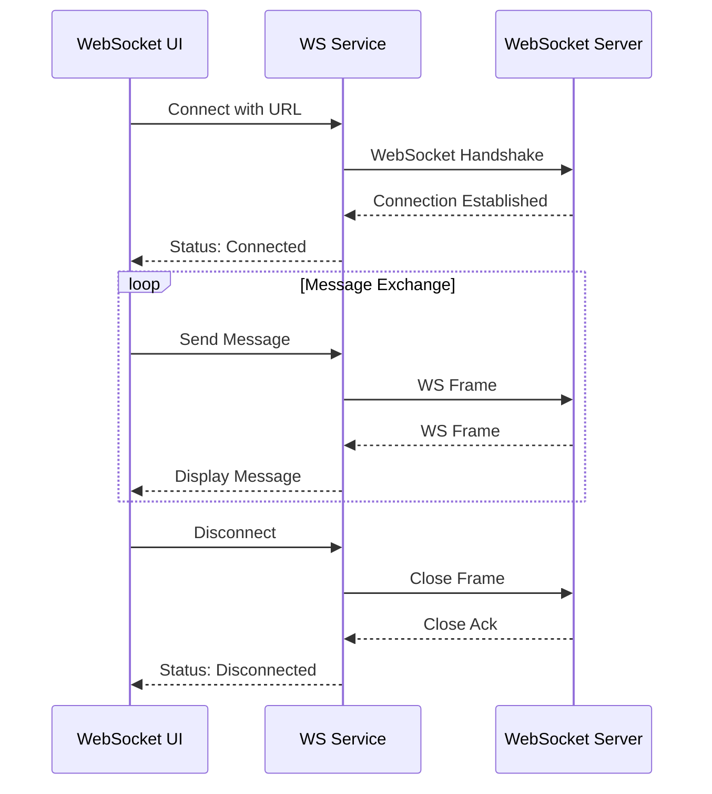
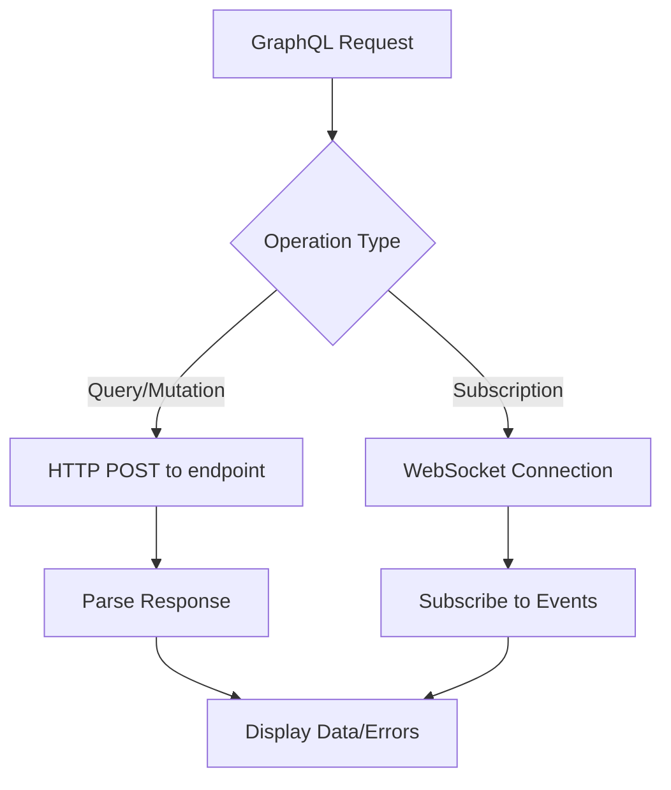

# WireSniff Desktop Application - Architecture Plan

## Overview

WireSniff is a cross-platform desktop API client (Postman competitor) built with Electron, React, TypeScript, Tailwind CSS, and Supabase for cloud storage. The application supports offline-first functionality with cloud sync for paid users.

## Technology Stack

| Layer | Technology |
|-------|------------|
| Desktop Framework | Electron 28+ |
| Frontend | React 18+ with TypeScript |
| Build Tool | Vite |
| Styling | Tailwind CSS |
| State Management | Zustand |
| Local Database | better-sqlite3 |
| Cloud Database | Supabase (PostgreSQL) |
| Authentication | Supabase Auth |
| Payments | Stripe + CoinPayPortal (crypto) |
| HTTP Client | Electron net module |
| WebSocket Client | ws library |
| GraphQL Client | graphql-request + graphql |
| SSE Client | eventsource |
| Code Editor | Monaco Editor |
| Runtime | Node.js 24 |

## Application Architecture



## Folder Structure

```
wiresniff-desktop-electron/
├── electron/
│   ├── main/
│   │   ├── index.ts              # Main process entry
│   │   ├── ipc/                   # IPC handlers
│   │   │   ├── database.ts
│   │   │   ├── http-client.ts
│   │   │   ├── file-system.ts
│   │   │   └── index.ts
│   │   ├── database/
│   │   │   ├── schema.ts
│   │   │   ├── migrations/
│   │   │   └── index.ts
│   │   └── menu.ts               # Application menu
│   └── preload/
│       └── index.ts              # Preload scripts
├── src/
│   ├── main.tsx                  # React entry point
│   ├── App.tsx                   # Root component
│   ├── components/
│   │   ├── layout/
│   │   │   ├── Header.tsx
│   │   │   ├── Sidebar.tsx
│   │   │   ├── MainLayout.tsx
│   │   │   └── Footer.tsx
│   │   ├── request-builder/
│   │   │   ├── RequestBuilder.tsx
│   │   │   ├── MethodSelector.tsx
│   │   │   ├── UrlInput.tsx
│   │   │   ├── ParamsTab.tsx
│   │   │   ├── HeadersTab.tsx
│   │   │   ├── BodyTab.tsx
│   │   │   ├── AuthTab.tsx
│   │   │   └── ScriptsTab.tsx
│   │   ├── response-viewer/
│   │   │   ├── ResponseViewer.tsx
│   │   │   ├── BodyViewer.tsx
│   │   │   ├── HeadersViewer.tsx
│   │   │   ├── CookiesViewer.tsx
│   │   │   └── TimelineViewer.tsx
│   │   ├── websocket/
│   │   │   ├── WebSocketBuilder.tsx
│   │   │   ├── WebSocketMessages.tsx
│   │   │   ├── MessageComposer.tsx
│   │   │   └── ConnectionStatus.tsx
│   │   ├── graphql/
│   │   │   ├── GraphQLBuilder.tsx
│   │   │   ├── QueryEditor.tsx
│   │   │   ├── VariablesEditor.tsx
│   │   │   ├── SchemaExplorer.tsx
│   │   │   └── GraphQLResponse.tsx
│   │   ├── sse/
│   │   │   ├── SSEBuilder.tsx
│   │   │   ├── EventStream.tsx
│   │   │   ├── EventFilter.tsx
│   │   │   └── SSEStatus.tsx
│   │   ├── collections/
│   │   │   ├── CollectionTree.tsx
│   │   │   ├── CollectionManager.tsx
│   │   │   └── FolderItem.tsx
│   │   ├── environments/
│   │   │   ├── EnvironmentManager.tsx
│   │   │   ├── VariableEditor.tsx
│   │   │   └── EnvironmentSelector.tsx
│   │   ├── network-inspector/
│   │   │   ├── NetworkInspector.tsx
│   │   │   ├── RequestList.tsx
│   │   │   └── RequestDetail.tsx
│   │   ├── settings/
│   │   │   ├── SettingsPage.tsx
│   │   │   ├── AppearanceSettings.tsx
│   │   │   ├── ProxySettings.tsx
│   │   │   └── SecuritySettings.tsx
│   │   ├── auth/
│   │   │   ├── LoginPage.tsx
│   │   │   ├── SignupPage.tsx
│   │   │   └── AuthGuard.tsx
│   │   ├── common/
│   │   │   ├── KeyValueEditor.tsx
│   │   │   ├── JsonEditor.tsx
│   │   │   ├── TabBar.tsx
│   │   │   ├── Modal.tsx
│   │   │   └── Button.tsx
│   │   └── states/
│   │       ├── EmptyState.tsx
│   │       ├── ErrorState.tsx
│   │       └── LoadingState.tsx
│   ├── pages/
│   │   ├── Welcome.tsx
│   │   ├── Workspace.tsx
│   │   ├── Collections.tsx
│   │   ├── Environments.tsx
│   │   ├── NetworkInspector.tsx
│   │   └── Settings.tsx
│   ├── services/
│   │   ├── http-client.ts
│   │   ├── websocket-client.ts
│   │   ├── graphql-client.ts
│   │   ├── sse-client.ts
│   │   ├── database.ts
│   │   ├── supabase.ts
│   │   ├── auth.ts
│   │   ├── stripe.ts
│   │   ├── coinpayportal.ts
│   │   ├── sync.ts
│   │   ├── import/
│   │   │   ├── postman.ts
│   │   │   ├── openapi.ts
│   │   │   └── curl.ts
│   │   └── export.ts
│   ├── stores/
│   │   ├── auth.store.ts
│   │   ├── collections.store.ts
│   │   ├── environments.store.ts
│   │   ├── requests.store.ts
│   │   ├── settings.store.ts
│   │   └── sync.store.ts
│   ├── hooks/
│   │   ├── useAuth.ts
│   │   ├── useRequest.ts
│   │   ├── useCollection.ts
│   │   ├── useEnvironment.ts
│   │   └── useSync.ts
│   ├── types/
│   │   ├── request.ts
│   │   ├── websocket.ts
│   │   ├── graphql.ts
│   │   ├── sse.ts
│   │   ├── collection.ts
│   │   ├── environment.ts
│   │   ├── response.ts
│   │   └── user.ts
│   ├── utils/
│   │   ├── variable-substitution.ts
│   │   ├── json-formatter.ts
│   │   ├── url-parser.ts
│   │   └── crypto.ts
│   └── styles/
│       └── globals.css
├── supabase/
│   ├── migrations/
│   └── functions/
├── resources/
│   ├── icons/
│   └── assets/
├── package.json
├── electron-builder.yml
├── vite.config.ts
├── tailwind.config.js
├── tsconfig.json
└── .env.example
```

## Database Schema

### Local SQLite Schema

```sql
-- Collections
CREATE TABLE collections (
    id TEXT PRIMARY KEY,
    name TEXT NOT NULL,
    description TEXT,
    parent_id TEXT REFERENCES collections(id),
    order_index INTEGER DEFAULT 0,
    created_at DATETIME DEFAULT CURRENT_TIMESTAMP,
    updated_at DATETIME DEFAULT CURRENT_TIMESTAMP,
    synced_at DATETIME,
    is_deleted INTEGER DEFAULT 0
);

-- Requests
CREATE TABLE requests (
    id TEXT PRIMARY KEY,
    collection_id TEXT REFERENCES collections(id),
    name TEXT NOT NULL,
    request_type TEXT NOT NULL DEFAULT 'http', -- http, websocket, graphql, sse
    method TEXT NOT NULL DEFAULT 'GET',
    url TEXT NOT NULL,
    params TEXT, -- JSON
    headers TEXT, -- JSON
    body TEXT,
    body_type TEXT DEFAULT 'none',
    auth TEXT, -- JSON
    pre_request_script TEXT,
    test_script TEXT,
    -- GraphQL specific
    graphql_query TEXT,
    graphql_variables TEXT, -- JSON
    graphql_operation_name TEXT,
    -- WebSocket specific
    ws_protocols TEXT, -- JSON array
    ws_messages TEXT, -- JSON array of saved messages
    -- SSE specific
    sse_with_credentials INTEGER DEFAULT 0,
    order_index INTEGER DEFAULT 0,
    created_at DATETIME DEFAULT CURRENT_TIMESTAMP,
    updated_at DATETIME DEFAULT CURRENT_TIMESTAMP,
    synced_at DATETIME,
    is_deleted INTEGER DEFAULT 0
);

-- WebSocket Message History
CREATE TABLE websocket_messages (
    id TEXT PRIMARY KEY,
    request_id TEXT REFERENCES requests(id),
    direction TEXT NOT NULL, -- sent, received
    message_type TEXT NOT NULL, -- text, binary
    data TEXT,
    timestamp DATETIME DEFAULT CURRENT_TIMESTAMP
);

-- SSE Event History
CREATE TABLE sse_events (
    id TEXT PRIMARY KEY,
    request_id TEXT REFERENCES requests(id),
    event_type TEXT,
    event_id TEXT,
    data TEXT,
    timestamp DATETIME DEFAULT CURRENT_TIMESTAMP
);

-- Environments
CREATE TABLE environments (
    id TEXT PRIMARY KEY,
    name TEXT NOT NULL,
    variables TEXT NOT NULL, -- JSON
    is_active INTEGER DEFAULT 0,
    created_at DATETIME DEFAULT CURRENT_TIMESTAMP,
    updated_at DATETIME DEFAULT CURRENT_TIMESTAMP,
    synced_at DATETIME,
    is_deleted INTEGER DEFAULT 0
);

-- Global Variables
CREATE TABLE global_variables (
    id TEXT PRIMARY KEY,
    key TEXT NOT NULL UNIQUE,
    value TEXT,
    is_secret INTEGER DEFAULT 0,
    created_at DATETIME DEFAULT CURRENT_TIMESTAMP,
    updated_at DATETIME DEFAULT CURRENT_TIMESTAMP
);

-- Request History
CREATE TABLE history (
    id TEXT PRIMARY KEY,
    request_id TEXT,
    method TEXT NOT NULL,
    url TEXT NOT NULL,
    request_headers TEXT, -- JSON
    request_body TEXT,
    response_status INTEGER,
    response_headers TEXT, -- JSON
    response_body TEXT,
    response_time INTEGER, -- milliseconds
    response_size INTEGER, -- bytes
    timing TEXT, -- JSON with DNS, TCP, TLS, TTFB, etc.
    created_at DATETIME DEFAULT CURRENT_TIMESTAMP
);

-- Settings
CREATE TABLE settings (
    key TEXT PRIMARY KEY,
    value TEXT NOT NULL,
    updated_at DATETIME DEFAULT CURRENT_TIMESTAMP
);

-- Sync Queue
CREATE TABLE sync_queue (
    id TEXT PRIMARY KEY,
    table_name TEXT NOT NULL,
    record_id TEXT NOT NULL,
    operation TEXT NOT NULL, -- INSERT, UPDATE, DELETE
    data TEXT, -- JSON
    created_at DATETIME DEFAULT CURRENT_TIMESTAMP,
    attempts INTEGER DEFAULT 0,
    last_error TEXT
);
```

### Supabase Schema

```sql
-- Users table is managed by Supabase Auth

-- User Profiles
CREATE TABLE profiles (
    id UUID PRIMARY KEY REFERENCES auth.users(id),
    email TEXT,
    full_name TEXT,
    avatar_url TEXT,
    subscription_tier TEXT DEFAULT 'free',
    stripe_customer_id TEXT,
    created_at TIMESTAMPTZ DEFAULT NOW(),
    updated_at TIMESTAMPTZ DEFAULT NOW()
);

-- Collections (cloud sync)
CREATE TABLE collections (
    id UUID PRIMARY KEY,
    user_id UUID REFERENCES auth.users(id) NOT NULL,
    name TEXT NOT NULL,
    description TEXT,
    parent_id UUID REFERENCES collections(id),
    order_index INTEGER DEFAULT 0,
    created_at TIMESTAMPTZ DEFAULT NOW(),
    updated_at TIMESTAMPTZ DEFAULT NOW(),
    deleted_at TIMESTAMPTZ
);

-- Requests (cloud sync)
CREATE TABLE requests (
    id UUID PRIMARY KEY,
    user_id UUID REFERENCES auth.users(id) NOT NULL,
    collection_id UUID REFERENCES collections(id),
    name TEXT NOT NULL,
    method TEXT NOT NULL DEFAULT 'GET',
    url TEXT NOT NULL,
    params JSONB,
    headers JSONB,
    body TEXT,
    body_type TEXT DEFAULT 'none',
    auth JSONB,
    pre_request_script TEXT,
    test_script TEXT,
    order_index INTEGER DEFAULT 0,
    created_at TIMESTAMPTZ DEFAULT NOW(),
    updated_at TIMESTAMPTZ DEFAULT NOW(),
    deleted_at TIMESTAMPTZ
);

-- Environments (cloud sync)
CREATE TABLE environments (
    id UUID PRIMARY KEY,
    user_id UUID REFERENCES auth.users(id) NOT NULL,
    name TEXT NOT NULL,
    variables JSONB NOT NULL,
    is_active BOOLEAN DEFAULT FALSE,
    created_at TIMESTAMPTZ DEFAULT NOW(),
    updated_at TIMESTAMPTZ DEFAULT NOW(),
    deleted_at TIMESTAMPTZ
);

-- Settings (cloud sync)
CREATE TABLE user_settings (
    user_id UUID PRIMARY KEY REFERENCES auth.users(id),
    settings JSONB NOT NULL DEFAULT '{}',
    updated_at TIMESTAMPTZ DEFAULT NOW()
);

-- Row Level Security Policies
ALTER TABLE profiles ENABLE ROW LEVEL SECURITY;
ALTER TABLE collections ENABLE ROW LEVEL SECURITY;
ALTER TABLE requests ENABLE ROW LEVEL SECURITY;
ALTER TABLE environments ENABLE ROW LEVEL SECURITY;
ALTER TABLE user_settings ENABLE ROW LEVEL SECURITY;

-- Users can only access their own data
CREATE POLICY "Users can view own profile" ON profiles FOR SELECT USING (auth.uid() = id);
CREATE POLICY "Users can update own profile" ON profiles FOR UPDATE USING (auth.uid() = id);

CREATE POLICY "Users can CRUD own collections" ON collections FOR ALL USING (auth.uid() = user_id);
CREATE POLICY "Users can CRUD own requests" ON requests FOR ALL USING (auth.uid() = user_id);
CREATE POLICY "Users can CRUD own environments" ON environments FOR ALL USING (auth.uid() = user_id);
CREATE POLICY "Users can CRUD own settings" ON user_settings FOR ALL USING (auth.uid() = user_id);
```

## Data Flow Architecture



## Sync Strategy



## Authentication Flow



## Payment Flow



## Supported Request Types

| Type | Description | Use Case |
|------|-------------|----------|
| HTTP/REST | Standard HTTP requests | REST APIs, web services |
| WebSocket | Bidirectional real-time | Chat, live updates, gaming |
| GraphQL | Query language for APIs | Flexible data fetching |
| SSE | Server-sent events | Live feeds, notifications |

## Feature Flags by Subscription Tier

| Feature | Free | Pro |
|---------|------|-----|
| Local Collections | ✅ Unlimited | ✅ Unlimited |
| Cloud Sync | ❌ | ✅ |
| Request History | 50 items | Unlimited |
| Environments | 3 | Unlimited |
| WebSocket Support | ✅ | ✅ |
| GraphQL Support | ✅ | ✅ |
| SSE Support | ✅ | ✅ |
| GraphQL Schema Explorer | ❌ | ✅ |
| Team Collaboration | ❌ | ✅ |
| Priority Support | ❌ | ✅ |
| Custom Themes | ❌ | ✅ |

### Payment Options
- **Stripe**: Credit/debit cards, Apple Pay, Google Pay
- **CoinPayPortal**: Bitcoin, Ethereum, USDT, and other cryptocurrencies

## Key Components

### HTTP Client Service

The HTTP client uses Electron's `net` module for making requests, which provides:
- Full control over SSL/TLS
- Proxy support
- Request timing metrics
- Cookie handling
- Redirect following

### WebSocket Client Service

Real-time bidirectional communication support:
- Connection management with auto-reconnect
- Message history tracking
- Binary and text message support
- Custom protocols/subprotocols
- Connection status monitoring
- Ping/pong heartbeat handling



### GraphQL Client Service

Full GraphQL support including:
- Query, Mutation, and Subscription operations
- Schema introspection and documentation explorer
- Variables editor with JSON validation
- Operation name selection for multi-operation documents
- Automatic persisted queries support
- Response with data and errors separation



### Server-Sent Events Client

Unidirectional server-to-client streaming:
- Event stream connection management
- Event type filtering
- Event ID tracking for reconnection
- Last-Event-ID header support
- Auto-reconnection with backoff
- Event history with search

### Variable Substitution Engine

Variables are substituted in the following order of precedence:
1. Collection variables
2. Environment variables
3. Global variables

Syntax: `{{variableName}}`

### Import Parsers

- **Postman**: Parse Postman Collection v2.1 JSON format
- **OpenAPI**: Parse OpenAPI 3.0 and Swagger 2.0 specifications
- **cURL**: Parse cURL command strings into request objects

## Security Considerations

1. **Secure Storage**: Sensitive data (API keys, tokens) encrypted using Electron's safeStorage
2. **Context Isolation**: Renderer process isolated from Node.js APIs
3. **CSP**: Strict Content Security Policy
4. **IPC Validation**: All IPC messages validated before processing
5. **RLS**: Row Level Security on all Supabase tables

## Build Configuration

### Electron Builder Targets

- **macOS**: DMG, ZIP (universal binary for Intel + Apple Silicon)
- **Windows**: NSIS installer, portable EXE
- **Linux**: AppImage, DEB, RPM

### Auto-Update

Using `electron-updater` with GitHub Releases for update distribution.