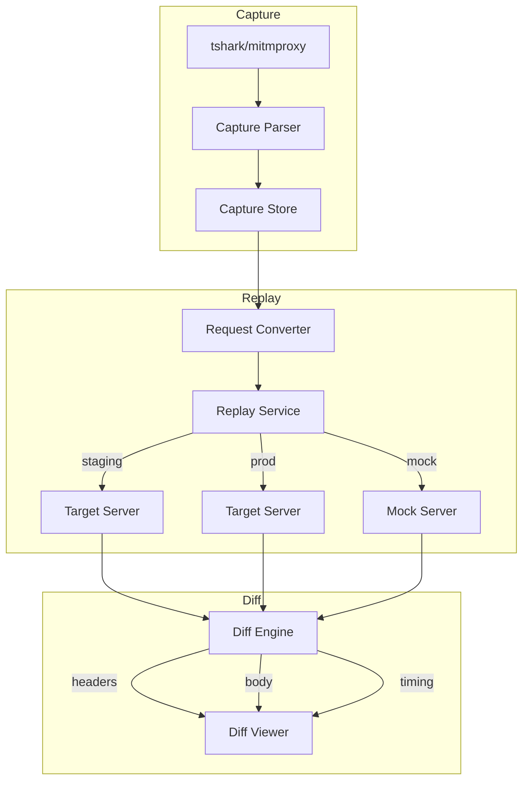
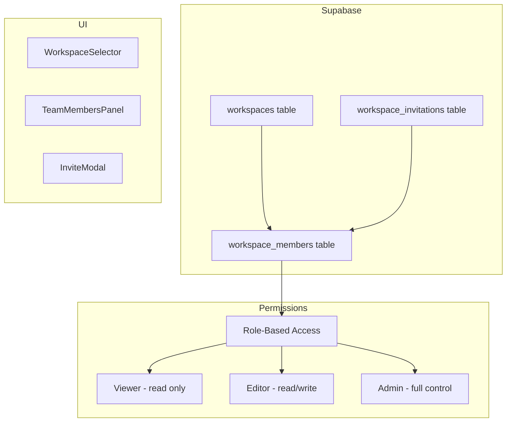
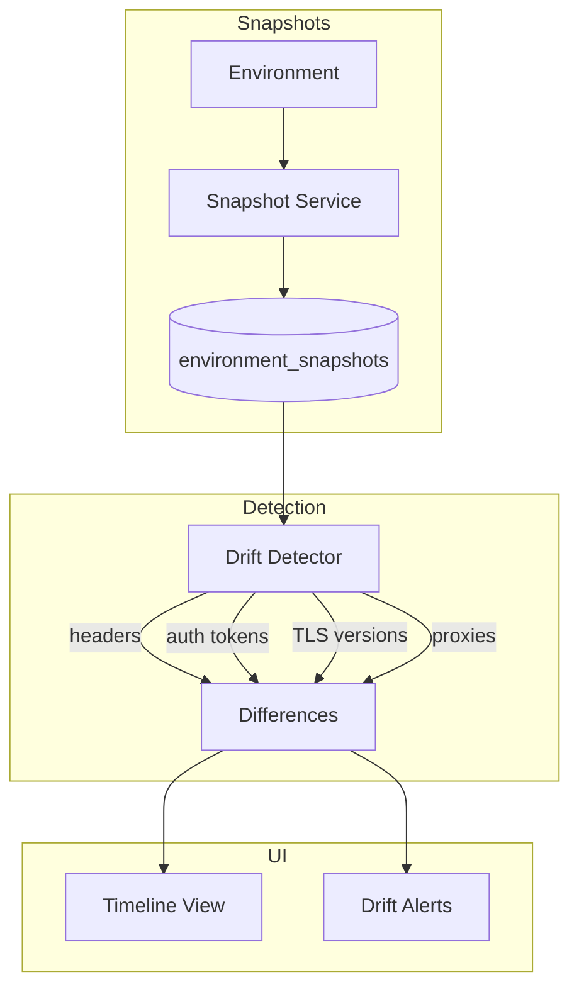
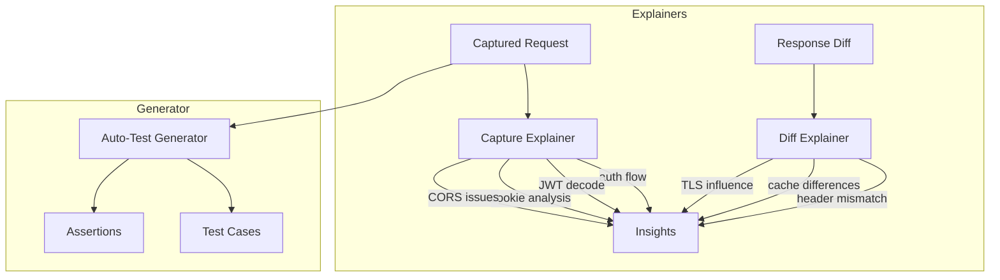
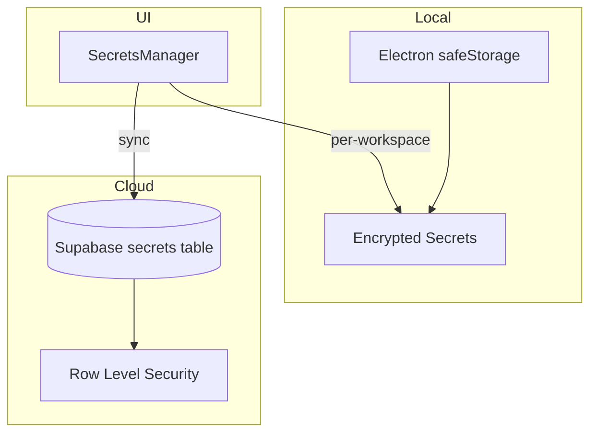
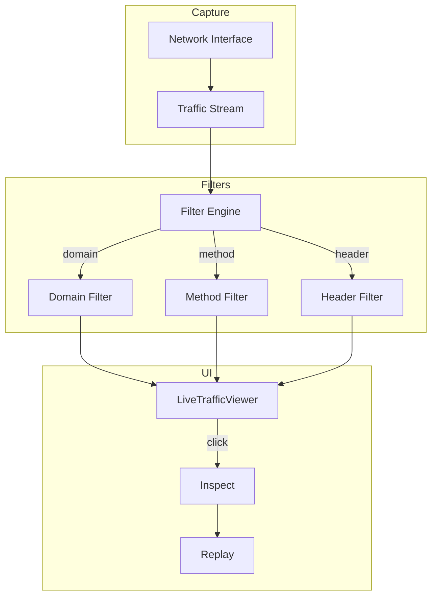
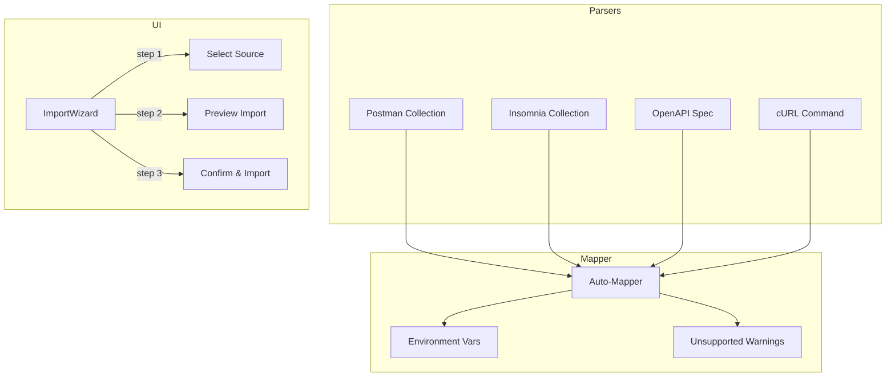

# WireSniff v1 Feature Implementation Plan

## Overview

This plan covers the implementation of 8 major features for WireSniff v1, following TDD principles with Vitest.

## Architecture Diagrams

### Feature 1: Request Capture → Replay → Diff



### Feature 2: Team Workspaces



### Feature 3: Environment Timeline / Drift Detection



### Feature 4: AI Features



### Feature 5: Secrets Vault



### Feature 6: Live Traffic Watch



### Feature 7: Protocol Superpowers

```mermaid
flowchart TD
    subgraph WebSocket
        WS[websocat integration]
        WS --> WSS[Saved Streams]
    end
    
    subgraph gRPC
        GRPC[gRPC Client]
        GRPC --> PROTO[Proto Parser]
        PROTO --> REQ[Request Builder]
    end
    
    subgraph TCP
        TCP[Raw TCP Client]
        TCP --> ADV[Advanced Mode]
    end
    
    subgraph SSE
        SSE[Server-Sent Events]
        SSE --> EVT[Event Stream]
    end
```

### Feature 8: Import/Replace Postman



## Database Schema Additions

### Team Workspaces Tables

```sql
-- Workspaces
CREATE TABLE IF NOT EXISTS public.workspaces (
  id UUID PRIMARY KEY DEFAULT uuid_generate_v4(),
  name TEXT NOT NULL,
  description TEXT,
  owner_id UUID NOT NULL REFERENCES public.profiles(id) ON DELETE CASCADE,
  created_at TIMESTAMPTZ DEFAULT NOW(),
  updated_at TIMESTAMPTZ DEFAULT NOW(),
  is_deleted BOOLEAN DEFAULT FALSE
);

-- Workspace Members
CREATE TABLE IF NOT EXISTS public.workspace_members (
  id UUID PRIMARY KEY DEFAULT uuid_generate_v4(),
  workspace_id UUID NOT NULL REFERENCES public.workspaces(id) ON DELETE CASCADE,
  user_id UUID NOT NULL REFERENCES public.profiles(id) ON DELETE CASCADE,
  role TEXT NOT NULL CHECK (role IN ('viewer', 'editor', 'admin')),
  joined_at TIMESTAMPTZ DEFAULT NOW(),
  UNIQUE(workspace_id, user_id)
);

-- Workspace Invitations
CREATE TABLE IF NOT EXISTS public.workspace_invitations (
  id UUID PRIMARY KEY DEFAULT uuid_generate_v4(),
  workspace_id UUID NOT NULL REFERENCES public.workspaces(id) ON DELETE CASCADE,
  email TEXT NOT NULL,
  role TEXT NOT NULL CHECK (role IN ('viewer', 'editor', 'admin')),
  invited_by UUID NOT NULL REFERENCES public.profiles(id),
  token TEXT NOT NULL UNIQUE,
  expires_at TIMESTAMPTZ NOT NULL,
  accepted_at TIMESTAMPTZ,
  created_at TIMESTAMPTZ DEFAULT NOW()
);
```

### Environment Snapshots Table

```sql
CREATE TABLE IF NOT EXISTS public.environment_snapshots (
  id UUID PRIMARY KEY DEFAULT uuid_generate_v4(),
  environment_id UUID NOT NULL REFERENCES public.environments(id) ON DELETE CASCADE,
  user_id UUID NOT NULL REFERENCES public.profiles(id) ON DELETE CASCADE,
  variables JSONB NOT NULL,
  headers_config JSONB,
  auth_config JSONB,
  tls_config JSONB,
  proxy_config JSONB,
  snapshot_reason TEXT,
  created_at TIMESTAMPTZ DEFAULT NOW()
);
```

### Secrets Vault Table

```sql
CREATE TABLE IF NOT EXISTS public.secrets (
  id UUID PRIMARY KEY DEFAULT uuid_generate_v4(),
  workspace_id UUID REFERENCES public.workspaces(id) ON DELETE CASCADE,
  user_id UUID NOT NULL REFERENCES public.profiles(id) ON DELETE CASCADE,
  name TEXT NOT NULL,
  encrypted_value TEXT NOT NULL,
  encryption_key_id TEXT NOT NULL,
  created_at TIMESTAMPTZ DEFAULT NOW(),
  updated_at TIMESTAMPTZ DEFAULT NOW(),
  is_deleted BOOLEAN DEFAULT FALSE
);
```

### Captures Table

```sql
CREATE TABLE IF NOT EXISTS public.captures (
  id UUID PRIMARY KEY DEFAULT uuid_generate_v4(),
  user_id UUID NOT NULL REFERENCES public.profiles(id) ON DELETE CASCADE,
  workspace_id UUID REFERENCES public.workspaces(id) ON DELETE CASCADE,
  name TEXT NOT NULL,
  source TEXT NOT NULL CHECK (source IN ('tshark', 'mitmproxy', 'manual')),
  request_data JSONB NOT NULL,
  response_data JSONB,
  metadata JSONB,
  created_at TIMESTAMPTZ DEFAULT NOW(),
  is_deleted BOOLEAN DEFAULT FALSE
);

CREATE TABLE IF NOT EXISTS public.replays (
  id UUID PRIMARY KEY DEFAULT uuid_generate_v4(),
  capture_id UUID NOT NULL REFERENCES public.captures(id) ON DELETE CASCADE,
  user_id UUID NOT NULL REFERENCES public.profiles(id) ON DELETE CASCADE,
  target_environment TEXT NOT NULL,
  request_data JSONB NOT NULL,
  response_data JSONB NOT NULL,
  timing JSONB,
  created_at TIMESTAMPTZ DEFAULT NOW()
);

CREATE TABLE IF NOT EXISTS public.diffs (
  id UUID PRIMARY KEY DEFAULT uuid_generate_v4(),
  replay_a_id UUID NOT NULL REFERENCES public.replays(id) ON DELETE CASCADE,
  replay_b_id UUID NOT NULL REFERENCES public.replays(id) ON DELETE CASCADE,
  user_id UUID NOT NULL REFERENCES public.profiles(id) ON DELETE CASCADE,
  header_diff JSONB,
  body_diff JSONB,
  timing_diff JSONB,
  ai_explanation TEXT,
  created_at TIMESTAMPTZ DEFAULT NOW()
);
```

## Subscription Tier Feature Matrix

| Feature | Free | Pro | Team |
|---------|------|-----|------|
| Local Captures | ✅ 10/day | ✅ Unlimited | ✅ Unlimited |
| Cloud Sync Captures | ❌ | ✅ | ✅ |
| Replay | ✅ Local | ✅ + Cloud | ✅ + Cloud |
| Diff | ✅ Local | ✅ + Cloud | ✅ + Cloud |
| Team Workspaces | ❌ | ❌ | ✅ |
| Environment Timeline | ✅ 7 days | ✅ 90 days | ✅ Unlimited |
| AI Explainers | ❌ | ✅ | ✅ |
| Auto-Test Generator | ❌ | ✅ | ✅ |
| Secrets Vault | ✅ Local | ✅ + Cloud | ✅ + Cloud |
| Live Traffic Watch | ✅ | ✅ | ✅ |
| Save Traffic Sessions | ❌ | ✅ | ✅ |
| gRPC Support | ✅ | ✅ | ✅ |
| Raw TCP | ❌ | ✅ | ✅ |
| Import Postman/Insomnia | ✅ | ✅ | ✅ |

## TDD Workflow

For each feature, follow this pattern:

1. **Write failing tests first** - Define expected behavior
2. **Implement minimum code** - Make tests pass
3. **Refactor** - Clean up while keeping tests green
4. **Add integration tests** - Test component interactions
5. **Add E2E tests** - Test full user flows

## File Structure for New Features

```
src/
├── main/
│   └── services/
│       ├── capture/
│       │   ├── tsharkCapture.ts
│       │   ├── mitmproxyCapture.ts
│       │   └── captureParser.ts
│       ├── grpc/
│       │   └── grpcClient.ts
│       └── tcp/
│           └── tcpClient.ts
├── renderer/
│   ├── services/
│   │   ├── capture/
│   │   │   ├── captureService.ts
│   │   │   ├── captureService.test.ts
│   │   │   ├── replayService.ts
│   │   │   ├── replayService.test.ts
│   │   │   ├── diffEngine.ts
│   │   │   └── diffEngine.test.ts
│   │   ├── workspace/
│   │   │   ├── workspaceService.ts
│   │   │   ├── workspaceService.test.ts
│   │   │   ├── invitationService.ts
│   │   │   ├── invitationService.test.ts
│   │   │   ├── permissionService.ts
│   │   │   └── permissionService.test.ts
│   │   ├── environment/
│   │   │   ├── snapshotService.ts
│   │   │   ├── snapshotService.test.ts
│   │   │   ├── driftDetector.ts
│   │   │   └── driftDetector.test.ts
│   │   ├── ai/
│   │   │   ├── captureExplainer.ts
│   │   │   ├── captureExplainer.test.ts
│   │   │   ├── diffExplainer.ts
│   │   │   ├── diffExplainer.test.ts
│   │   │   ├── testGenerator.ts
│   │   │   └── testGenerator.test.ts
│   │   ├── secrets/
│   │   │   ├── secretsVault.ts
│   │   │   └── secretsVault.test.ts
│   │   ├── traffic/
│   │   │   ├── liveTrafficService.ts
│   │   │   └── liveTrafficService.test.ts
│   │   └── import/
│   │       ├── insomniaParser.ts
│   │       ├── insomniaParser.test.ts
│   │       ├── envMapper.ts
│   │       └── envMapper.test.ts
│   └── components/
│       ├── capture/
│       │   ├── CaptureViewer.tsx
│       │   ├── CaptureViewer.test.tsx
│       │   ├── ReplayPanel.tsx
│       │   ├── ReplayPanel.test.tsx
│       │   ├── DiffViewer.tsx
│       │   └── DiffViewer.test.tsx
│       ├── workspace/
│       │   ├── WorkspaceSelector.tsx
│       │   ├── WorkspaceSelector.test.tsx
│       │   ├── TeamMembersPanel.tsx
│       │   ├── TeamMembersPanel.test.tsx
│       │   ├── InviteModal.tsx
│       │   └── InviteModal.test.tsx
│       ├── environment/
│       │   ├── EnvironmentTimeline.tsx
│       │   ├── EnvironmentTimeline.test.tsx
│       │   ├── DriftAlert.tsx
│       │   └── DriftAlert.test.tsx
│       ├── ai/
│       │   ├── AIInsightsPanel.tsx
│       │   └── AIInsightsPanel.test.tsx
│       ├── secrets/
│       │   ├── SecretsManager.tsx
│       │   └── SecretsManager.test.tsx
│       ├── traffic/
│       │   ├── LiveTrafficViewer.tsx
│       │   ├── LiveTrafficViewer.test.tsx
│       │   ├── TrafficFilterBar.tsx
│       │   └── TrafficFilterBar.test.tsx
│       ├── grpc/
│       │   ├── GrpcBuilder.tsx
│       │   └── GrpcBuilder.test.tsx
│       ├── tcp/
│       │   ├── TcpBuilder.tsx
│       │   └── TcpBuilder.test.tsx
│       └── import/
│           ├── ImportWizard.tsx
│           └── ImportWizard.test.tsx
└── supabase/
    └── migrations/
        ├── 001_initial_schema.sql
        ├── 002_workspaces.sql
        ├── 003_environment_snapshots.sql
        ├── 004_secrets_vault.sql
        └── 005_captures_replays_diffs.sql